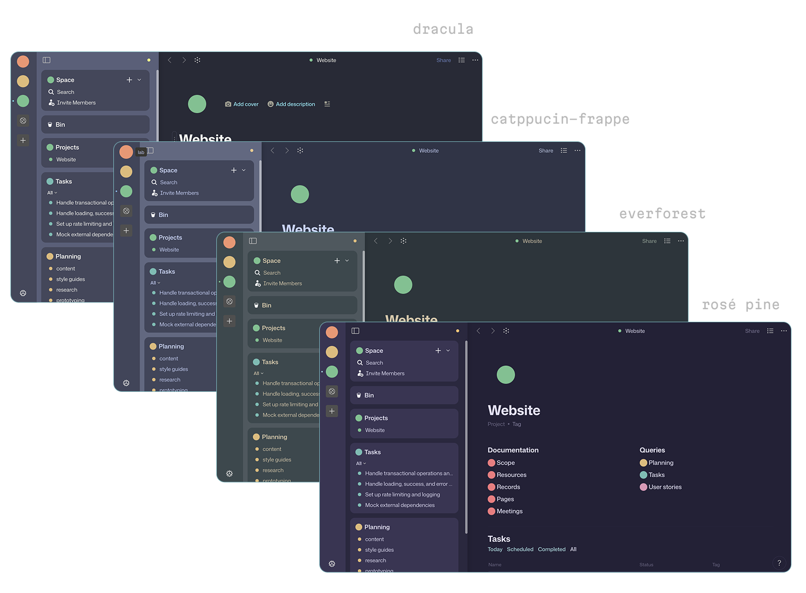
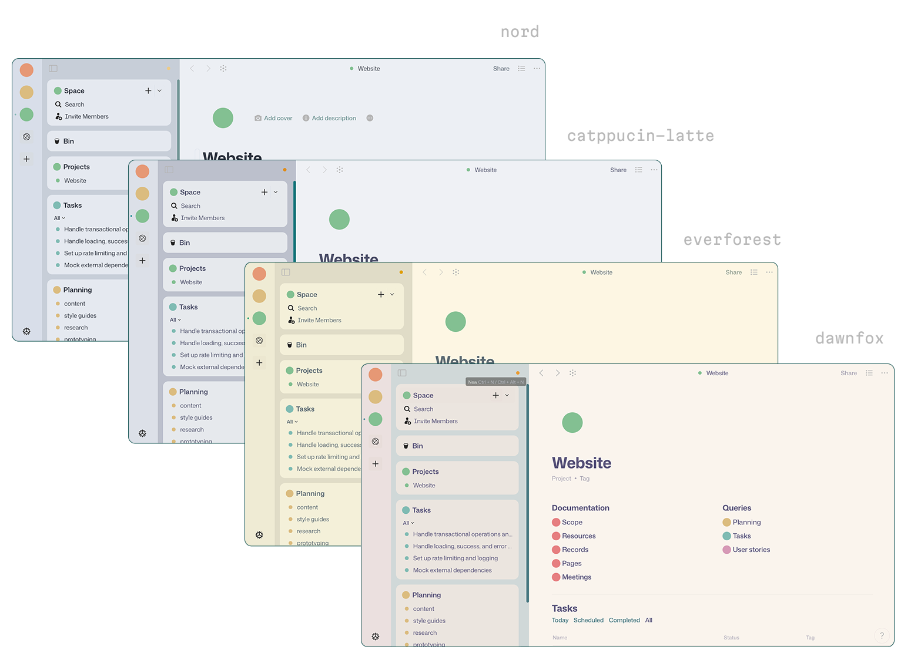

# Custom Anytype Themes

A collection of some of the most established themes to style and enhance your Anytype experience.
Whether you prefer a sleek dark mode, a minimalist look, or a burst of color, this project makes it easy to customize the appearance of your Anytype workspace.

---

## Screenshots




---

## How to Use

1. **Activate custom CSS in Anytype**
   Go to `Menu > File > Apply Custom CSS`.

2. **Open the custom CSS file**
   Go to `Menu > File > Open > custom.css`.
   On Linux, it's located at:

   ```
   ~/.config/anytype/custom.css
   ```

3. **Download this repository** or just navigate to themes/ and choose one
   * Clone with Git:

     ```bash
     git clone https://github.com/pedro-hga/custom-anytype-themes.git
     ```

4. **Copy the contents** of the desired `.css` file into your `custom.css` file.

5. **Restart Anytype** or reload with `Ctrl + R`.

---

## How to Customize

All color values are grouped near the top of each selector. To build a new theme, modify these values in both `:root {}` and `html.themedark {}`:

```css
  --theme-base: #eff1f5;
  --theme-surface: #e6e9ed;
  --theme-overlay: #dce0e8;
  --theme-highlight-high: #ccd0da;
  --theme-highlight-low: #bcc0cc;

  --theme-text: #4c4f69;
  --theme-grey1: #6c6f85;
  --theme-grey2: #7c7f93;

  --theme-red: #d20f39;
  --theme-orange: #fe640b;
  --theme-yellow: #df8e1d;
  --theme-green: #40a02b;
  --theme-aqua: #179299;
  --theme-blue: #1e66f5;
  --theme-purple: #ea76cb;
  --theme-pink: #f5bde6;
  --theme-cyan: #04a5e5;

  --theme-grey1-30: rgba(108, 111, 133, 0.3);
  --theme-grey2-30: rgba(124, 127, 147, 0.3);
  --theme-cyan-30: rgba(4, 165, 229, 0.3);
  --theme-green-30: rgba(64, 160, 43, 0.3);
  --theme-orange-30: rgba(254, 100, 11, 0.3);
  --theme-pink-30: rgba(245, 189, 230, 0.3);
  --theme-purple-30: rgba(234, 118, 203, 0.3);
  --theme-red-30: rgba(210, 15, 57, 0.3);
  --theme-yellow-30: rgba(223, 142, 29, 0.3);
  --theme-aqua-30: rgba(23, 146, 153, 0.3);
  --theme-blue-30: rgba(30, 102, 245, 0.3);
```

### Fonts

To change the fonts used in the theme, modify the following:

```css
html,
body,
* {
  font-family: "Mona Sans", sans-serif !important;
  font-feature-settings:
    "ss02" on,
    "ss04" on,
    "ss05" on,
    "ss08" on;
  -webkit-font-smoothing: antialiased !important;
  -moz-osx-font-smoothing: grayscale !important;
}

.textcode,
.textcode * {
  font-family: "Iosevka", "Monaspace Neon", monospace !important;
  font-feature-settings:
    "liga" on,
    "calt" on;
}
```

Here are the fonts that are used in this project (as shown in the screenshots):
- [Mona Sans](https://github.com/github/mona-sans)
- [Mona Space](https://github.com/githubnext/monaspace)
- [Iosevka](https://github.com/be5invis/Iosevka)

### Accents

To change the accent color used, just change the var() these lines in both `:root` and/or `html.themeDark`:

```css
  --color-control-accent: var(--theme-aqua);
  --color-control-active: var(--theme-aqua-hover);
```

---

## Known Issues

* Some parts of the UI may not support full theming due to the way Anytype is set up.
* This approach aims to make theming more agnostic, so it may not match the original theme 100%.
* Some themes don't include all the colors Anytype supports (e.g., pinks or ice).
* Some themes currently use the same values for aqua and cyan — color variants are still being developed.

---

## Support This Project

If you enjoy these themes and want to support further development:

[](https://www.buymeacoffee.com/pedrohga)

---

## Images

- I enjoy color coding all my spaces and objects (as seen in the screenshots) instead of using emojis, and for that I use a python snippet to create SVGs and convert them to .png, to be uploaded to anytype.
- There are a couple of images and the python code included in `images/`, but if you want to create more, just take the colors you want and change them in `colors.txt`.
- The first line is always the theme name you want to use, the rest is in this format: `--theme-red: #f85552;`. Place one color per line. The code ignores the "--theme-" and use the color name in the exit file name.
- To execute `colors.py` run `pip install cairosvg` in your environment and then `python colors.py`

---

Licensed under the [Unlicense](https://unlicense.org/).
